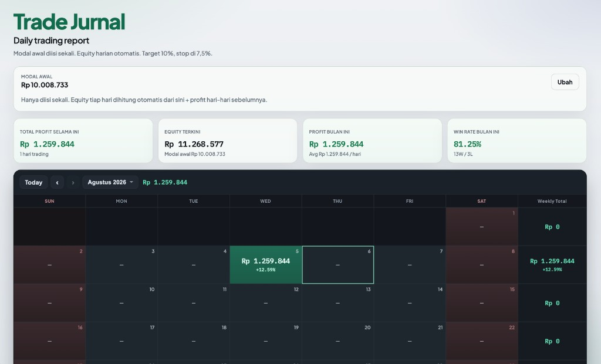

# Trade Jurnal

Personal web app untuk catat & report jurnal trading harian.

**Live:** [https://trade-jurnal-fikz.vercel.app](https://trade-jurnal-fikz.vercel.app)



Stack: **React + Vite + TypeScript + Cloud Firestore**. Deploy di **Vercel**.

## Fitur

- Modal awal diisi sekali; equity harian dihitung otomatis
- Input harian: total entry, lost entry, profit entry, total profit hari itu
- Auto-hitung **% kenaikan hari ini**
- Summary: total profit selama ini, equity terkini, profit & win rate bulan ini
- Kalender P/L bulanan + total mingguan
- Target harian **10%** & stop loss **7,5%**
- Tanpa login — langsung baca/tulis Firestore (personal use)

## Setup lokal

```bash
cd forex-journal
cp .env.example .env
npm install
npm run dev
```

Isi `.env` dengan config dari Firebase Console → Project settings → Your apps → Web app.

## Setup Firebase (Cloud Firestore)

1. Buat project di [Firebase Console](https://console.firebase.google.com/)
2. Aktifkan **Cloud Firestore** (bukan Realtime Database)
3. Tambah **Web app**, salin config ke `.env`
4. Rules untuk personal / tanpa login:

```
rules_version = '2';
service cloud.firestore {
  match /databases/{database}/documents {
    match /daily_entries/{docId} {
      allow read, write: if true;
    }
  }
}
```

> **Penting:** `allow read, write: if true` artinya siapa saja yang punya URL/app config bisa baca & tulis. Cocok hanya kalau app personal & URL tidak dipublikasikan luas.

### Struktur dokumen

Collection: `daily_entries`  
Document ID: `YYYY-MM-DD`

```json
{
  "date": "2026-08-05",
  "startingEquity": 10000,
  "totalEntries": 8,
  "lostEntries": 3,
  "profitEntries": 5,
  "dailyProfit": 120.5,
  "createdAt": "...",
  "updatedAt": "..."
}
```

Modal awal disimpan di `daily_entries/_settings`.

## Deploy Vercel

1. Push repo ke GitHub
2. Import project di Vercel
3. Tambahkan environment variables sama seperti `.env` (`VITE_FIREBASE_*`)
4. Deploy — build command: `npm run build`, output: `dist`

## Scripts

| Command           | Keterangan           |
| ----------------- | -------------------- |
| `npm run dev`     | Dev server lokal     |
| `npm run build`   | Production build     |
| `npm run preview` | Preview hasil build  |
